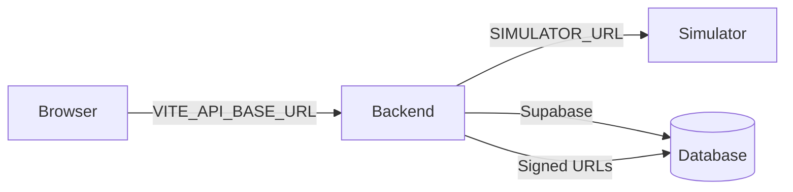

# ARIOT CleanBot Dashboard - Deployment Guide

## Architecture Overview

```
┌─────────────────────────────────────────────────────────────────┐
│  Vercel (Frontend)                                              │
│  React/Vite SPA                                                 │
│  URL: https://your-frontend.vercel.app                         │
│                                                                  │
│  Environment: VITE_API_BASE_URL=https://api.your-domain.com     │
└────────────────────────────────────┬────────────────────────────┘
                                     │ HTTPS
                                     ▼
┌─────────────────────────────────────────────────────────────────┐
│  Backend Host (Cloud/Server)                                    │
│  FastAPI on port 8000                                           │
│  URL: https://api.your-domain.com                              │
│                                                                  │
│  Environment:                                                   │
│    SUPABASE_URL=https://your-project.supabase.co                │
│    SUPABASE_KEY=anon_key                                        │
│    SUPABASE_SERVICE_ROLE_KEY=service_role_key (backend-only)    │
│    SUPABASE_JWKS_URL=.../auth/v1/.well-known/jwks.json         │
│    CORS_ORIGINS=https://your-frontend.vercel.app               │
│    SIMULATOR_URL=https://simulator.your-domain.com              │
└────────────────────────────────────┬────────────────────────────┘
                                     │
                                     ▼
┌─────────────────────────────────────────────────────────────────┐
│  Simulator Host (Dedicated Server/Container)                    │
│  Digital Twin on port 8100                                      │
│  URL: https://simulator.your-domain.com                        │
│                                                                  │
│  Run: python run.py --host 0.0.0.0 --port 8100                │
│  NOTE: This is a stateful service - cannot run in serverless   │
└─────────────────────────────────────────────────────────────────┘
                                     │
                                     ▼
┌─────────────────────────────────────────────────────────────────┐
│  Supabase (Auth + Database + Storage)                          │
│  - User authentication                                          │
│  - Robot profiles table                                         │
│  - Avatar storage bucket                                         │
│  - Row Level Security policies                                   │
└─────────────────────────────────────────────────────────────────┘
```

---

## A. Local Demo (Windows)

```powershell
.\start.ps1
```

**Expected:**
- Simulator : http://127.0.0.1:8100
- Backend   : http://127.0.0.1:8000
- Frontend  : http://localhost:5173

---

## B. Vercel Frontend Deployment

### 1. Import Project
- Go to [vercel.com](https://vercel.com)
- Import: `https://github.com/Pshawon-kundu/ARIOT_Dashboard`

### 2. Configure
- **Framework:** Vite
- **Root Directory:** `.` (repository root)
- **Build Command:** `npm run build`
- **Output Directory:** `dist`

### 3. Environment Variables
In Vercel dashboard, add:

| Name | Value |
|------|-------|
| `VITE_API_BASE_URL` | `https://your-backend-domain.com` |

### 4. Deploy
Click **Deploy**

---

## C. Backend Deployment (Render/Railway/Fly/VPS)

### Option 1: Docker (Recommended)

```bash
cd ariot-cleanbot-backend
docker build -t ariot-backend .
docker run -d -p 8000:8000 \
  -e SUPABASE_URL=https://your-project.supabase.co \
  -e SUPABASE_KEY=your_anon_key \
  -e SUPABASE_SERVICE_ROLE_KEY=your_service_role_key \
  -e SUPABASE_JWKS_URL=https://your-project.supabase.co/auth/v1/.well-known/jwks.json \
  -e CORS_ORIGINS=https://your-frontend.vercel.app \
  -e SIMULATOR_URL=https://simulator.your-domain.com \
  ariot-backend
```

### Option 2: Procfile (Render, Railway)

Platform automatically detects `Procfile`. Set environment variables in dashboard.

### Option 3: Manual Server

```bash
cd ariot-cleanbot-backend
pip install -r requirements.txt
uvicorn app.main:app --host 0.0.0.0 --port 8000
```

**Required Environment Variables:**

| Name | Description |
|------|-------------|
| `SUPABASE_URL` | Supabase project URL |
| `SUPABASE_KEY` | Supabase anon key |
| `SUPABASE_SERVICE_ROLE_KEY` | Supabase service role key (NEVER expose to frontend) |
| `SUPABASE_JWKS_URL` | Supabase JWKS endpoint |
| `CORS_ORIGINS` | Comma-separated frontend origins |
| `SIMULATOR_URL` | Digital Twin simulator URL |
| `DEV_JWT_SECRET` | (Local dev only) JWT signing secret |

---

## D. Simulator Deployment (Dedicated Host)

**IMPORTANT:** The simulator is a stateful long-running process. It cannot run in serverless environments (Vercel, AWS Lambda, etc.). Deploy to a dedicated VM, container host, or Raspberry Pi.

### Docker

```bash
cd ariot-cleanbot-simulator
docker build -t ariot-simulator .
docker run -d -p 8100:8100 ariot-simulator
```

### Manual

```bash
cd ariot-cleanbot-simulator
pip install -r requirements.txt
python run.py --host 0.0.0.0 --port 8100
```

---

## E. Supabase Setup

### 1. Create Project
- Go to [supabase.com](https://supabase.com)
- Create new project

### 2. Run Migration
Execute `ariot-cleanbot-backend/supabase/migrations/20260903_account_profiles.sql` in SQL Editor.

This creates:
- `avatar_path` column in profiles table
- RLS policies for profiles
- Private `avatars` storage bucket

### 3. Environment Variables
Copy from Supabase dashboard:
- `SUPABASE_URL`
- `SUPABASE_KEY` (Settings > API > anon public key)
- `SUPABASE_SERVICE_ROLE_KEY` (Settings > API > service_role key)

---

## F. CORS Configuration

After deploying frontend to Vercel, update backend:

```bash
# Environment variable
CORS_ORIGINS=https://your-frontend.vercel.app
```

For multiple origins:
```
CORS_ORIGINS=https://vercel.app,https://*.vercel.app
```

---

## G. Final Connection



Set in Vercel:
```
VITE_API_BASE_URL=https://api.your-domain.com
```

Set in Backend:
```
SIMULATOR_URL=https://simulator.your-domain.com
CORS_ORIGINS=https://your-frontend.vercel.app
```

---

## Troubleshooting

### Frontend shows "Authentication required"
- Verify `VITE_API_BASE_URL` points to backend
- Check browser console for CORS errors
- Verify backend `CORS_ORIGINS` includes your frontend URL

### Backend 503 on /robots/simulator
- Verify `SIMULATOR_URL` environment variable on backend
- Verify simulator service is running and accessible
- Check backend logs for connection errors

### Avatar upload fails
- Verify `avatars` storage bucket exists in Supabase
- Verify RLS policies allow backend service role access
- Check signed URL expiration settings

---

## Security Notes

- **Never** commit `.env` files
- **Never** expose `SUPABASE_SERVICE_ROLE_KEY` to frontend
- Use **Row Level Security** on all Supabase tables
- Use **private** storage buckets with signed URLs for avatars
- Rotate secrets regularly
